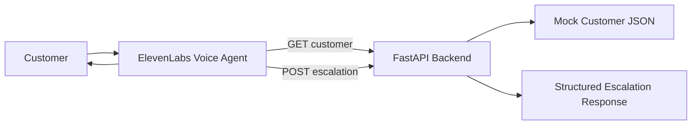

# Voice Support Triage MVP — Codex Build Plan

## 1. Goal

Build a small, working portfolio MVP for an ElevenLabs Solutions Engineer application.

The project should demonstrate that I can:

- work with a customer-facing technical problem;
- build a Python API integration;
- connect an ElevenLabs voice agent to an external REST API;
- design clear troubleshooting and escalation logic;
- document a solution so another person can understand and run it;
- identify a repeatable support pattern and turn it into a reusable workflow.

The finished project must be:

- free to build and test;
- simple enough to complete in one focused build session;
- deployed publicly;
- pushed to GitHub;
- documented with a strong README;
- understandable by me, not just generated by Codex.

Project name: **Voice Support Triage**

One-line description:

> A lightweight ElevenLabs voice agent that checks mock SaaS account data through a Python API and either explains the next step or creates a structured engineering escalation.

---

## 2. Scope Freeze

Do not add features outside this MVP unless I explicitly ask.

### Build

1. A Python FastAPI backend.
2. A small JSON file containing mock customer records.
3. A `GET /customers/{customer_id}` endpoint.
4. A `POST /escalations` endpoint.
5. A simple web page that embeds an ElevenLabs public agent widget.
6. Basic automated API tests with pytest.
7. Clean error handling and readable JSON responses.
8. A README that explains the problem, architecture, setup, demo flow, testing, and what I learned.
9. A short setup document for configuring the ElevenLabs webhook tools.
10. A free Render deployment.
11. A GitHub repository with no secrets committed.

### Do NOT build

- authentication;
- a database;
- a dashboard;
- user accounts;
- Kubernetes;
- Docker unless required for deployment;
- multiple microservices;
- payment processing;
- a real ticketing-system integration;
- a real customer-data integration;
- analytics infrastructure;
- complex frontend styling;
- paid ElevenLabs features;
- ElevenLabs Code Tools;
- anything that makes the MVP harder to explain.

---

## 3. User Story

As a SaaS customer with an account-access problem, I want to explain my issue to a voice assistant so it can check my account and either give me the appropriate next step or create a useful engineering escalation without forcing me to repeat the entire troubleshooting process.

---

## 4. Demo Scenarios

Use only mock data.

### CUST-101 — Healthy account

```json
{
  "customer_id": "CUST-101",
  "name": "Jordan Lee",
  "subscription_status": "active",
  "entitlement_enabled": true,
  "account_status": "active"
}
```

Expected agent behavior:

- confirm that the account and entitlement appear healthy;
- explain that the account configuration looks correct;
- recommend a simple sign-out/sign-in retry;
- do not create an escalation unless the user says the issue continues.

### CUST-102 — Missing entitlement

```json
{
  "customer_id": "CUST-102",
  "name": "Taylor Smith",
  "subscription_status": "active",
  "entitlement_enabled": false,
  "account_status": "active"
}
```

Expected agent behavior:

- explain that the subscription is active;
- identify that the required entitlement is missing;
- create an engineering escalation;
- tell the customer what was found and that the technical details were included in the escalation.

### CUST-103 — Inactive subscription

```json
{
  "customer_id": "CUST-103",
  "name": "Morgan Chen",
  "subscription_status": "inactive",
  "entitlement_enabled": false,
  "account_status": "active"
}
```

Expected agent behavior:

- explain that the account exists but the subscription is inactive;
- recommend checking renewal/billing status;
- do not create an engineering escalation because the mock data already explains the access issue.

### Unknown customer

Expected behavior:

- return a clear 404 response from the API;
- the agent should ask the customer to verify the ID;
- do not invent account information.

---

## 5. API Contract

### GET `/health`

Purpose: deployment and smoke-test endpoint.

Response:

```json
{
  "status": "ok"
}
```

### GET `/customers/{customer_id}`

Purpose: return mock account information for the voice agent.

Successful response example:

```json
{
  "customer_id": "CUST-102",
  "name": "Taylor Smith",
  "subscription_status": "active",
  "entitlement_enabled": false,
  "account_status": "active"
}
```

Unknown customer:

- HTTP 404
- readable error message

Example:

```json
{
  "detail": "Customer CUST-999 was not found."
}
```

### POST `/escalations`

Purpose: create a structured escalation record from troubleshooting context.

Request model:

```json
{
  "customer_id": "CUST-102",
  "issue": "Unable to access subscribed content",
  "finding": "Subscription is active but entitlement is disabled",
  "troubleshooting_performed": [
    "Verified customer account",
    "Verified subscription status",
    "Checked entitlement state"
  ]
}
```

Response model:

```json
{
  "status": "created",
  "escalation_id": "ESC-0001",
  "customer_id": "CUST-102",
  "issue": "Unable to access subscribed content",
  "finding": "Subscription is active but entitlement is disabled",
  "troubleshooting_performed": [
    "Verified customer account",
    "Verified subscription status",
    "Checked entitlement state"
  ],
  "recommended_team": "Engineering"
}
```

The escalation can be stored in memory for demo purposes. Persistence is not required.

---

## 6. Recommended Repository Structure

```text
voice-support-triage/
├── app/
│   ├── __init__.py
│   ├── main.py
│   ├── models.py
│   ├── services.py
│   ├── data/
│   │   └── customers.json
│   └── static/
│       └── index.html
├── docs/
│   └── elevenlabs-setup.md
├── tests/
│   └── test_api.py
├── .env.example
├── .gitignore
├── requirements.txt
├── render.yaml
└── README.md
```

Keep the architecture this small.

---

## 7. Technology Choices

### Backend

- Python 3.11+
- FastAPI
- Uvicorn
- Pydantic

### Testing

- pytest
- FastAPI TestClient

### Voice interface

- ElevenLabs Agents public web widget
- ElevenLabs webhook tools that call the FastAPI endpoints

### Hosting

- Render free web service

### Source control

- Git
- GitHub

No database is required.

---

## 8. Free-Tier Rules

The project must not require payment.

1. Use the ElevenLabs Free Agents plan.
2. Keep total voice testing comfortably below the included monthly call allowance.
3. Do not enable pay-as-you-go billing for this project.
4. Use webhook tools, not enterprise-only Code Tools.
5. Deploy the Python app on a Render Free web service.
6. Use only mock data.
7. Do not purchase a domain.
8. Do not introduce any dependency that requires a paid account.

If any planned feature requires payment, stop and propose a free alternative before implementing it.

---

## 9. ElevenLabs Configuration

The Python repository should NOT contain an ElevenLabs secret key.

Create the agent manually in the ElevenLabs dashboard.

### Agent purpose

The agent is a technical support triage assistant for a fictional SaaS product called **StreamDesk**.

### Suggested first message

> Hi, I’m the StreamDesk support assistant. I can help troubleshoot account-access issues. What seems to be happening?

### Required behavior

The agent should:

1. Ask for a customer ID when an account-access problem is reported.
2. Call `get_customer` before making claims about account status.
3. Never invent customer or subscription information.
4. Explain findings in plain language.
5. If the subscription is active but `entitlement_enabled` is false, call `create_escalation`.
6. If the subscription is inactive, explain the likely cause and recommend checking renewal/billing.
7. If the account appears healthy, suggest a sign-out/sign-in retry.
8. Keep responses concise.
9. Tell the customer when an escalation is created.
10. Never claim that an engineer has fixed the issue.

### Webhook tool 1 — `get_customer`

Method: GET

URL:

```text
https://YOUR-RENDER-URL.onrender.com/customers/{customer_id}
```

Path parameter:

- `customer_id`
- string
- description: "The customer account ID, for example CUST-102."

### Webhook tool 2 — `create_escalation`

Method: POST

URL:

```text
https://YOUR-RENDER-URL.onrender.com/escalations
```

Body parameters:

- `customer_id`
- `issue`
- `finding`
- `troubleshooting_performed`

Configure descriptions clearly so the agent knows when and how to call the tool.

### Widget

Use a public agent with widget access enabled.

Embed the widget in `app/static/index.html`.

Do not hard-code secrets in the page.

---

## 10. Frontend Requirement

The frontend should be intentionally minimal.

Display:

- project name;
- one-sentence explanation;
- three demo customer IDs;
- expected scenario for each ID;
- ElevenLabs voice widget;
- GitHub link placeholder.

No framework is required.

Use plain HTML and small amounts of CSS.

FastAPI should serve the page at `/`.

---

## 11. Tests

Write automated tests for at least:

1. `GET /health` returns 200.
2. `GET /customers/CUST-101` returns the correct account.
3. `GET /customers/CUST-102` shows `entitlement_enabled == false`.
4. Unknown customer returns 404.
5. Valid escalation returns 200/201 and a generated escalation ID.
6. Invalid escalation input fails validation.

Keep tests deterministic.

---

## 12. Manual Acceptance Tests

Before calling the project complete, manually run these conversations.

### Test A — healthy account

Input: CUST-101

Pass if:

- correct account is retrieved;
- agent does not invent a problem;
- agent suggests a reasonable retry;
- no unnecessary escalation is created.

### Test B — missing entitlement

Input: CUST-102

Pass if:

- account is retrieved;
- agent identifies missing entitlement;
- escalation endpoint is called;
- response contains the correct account, finding, and troubleshooting steps;
- agent tells the customer an escalation was created.

### Test C — inactive subscription

Input: CUST-103

Pass if:

- account is retrieved;
- inactive subscription is communicated clearly;
- no engineering escalation is created.

### Test D — invalid customer

Input: CUST-999

Pass if:

- API returns 404;
- agent asks the user to verify the ID;
- agent does not fabricate account details.

Record the results in the README.

---

## 13. README Requirements

The final README must be recruiter-friendly.

Required sections:

1. **Voice Support Triage**
2. **What problem does it solve?**
3. **Why I built it**
4. **Demo**
5. **Architecture**
6. **How it works**
7. **API endpoints**
8. **ElevenLabs integration**
9. **Local setup**
10. **Testing**
11. **Deployment**
12. **Results / acceptance testing**
13. **What I learned**
14. **Future improvements**
15. **Tech stack**

### Architecture diagram

Use a simple Mermaid diagram:



### README tone

Do not oversell.

Explain:

- this is an MVP;
- data is fictional;
- escalation persistence is intentionally omitted;
- the objective is to demonstrate customer-facing technical integration and support automation.

---

## 14. GitHub Requirements

Repository name:

```text
voice-support-triage-elevenlabs
```

Before pushing:

- run all tests;
- remove secrets;
- verify `.env` is ignored;
- make sure README renders correctly;
- use clean commit messages.

Suggested commits:

```text
chore: initialize FastAPI project
feat: add mock customer lookup API
feat: add structured escalation endpoint
test: add API test coverage
feat: embed ElevenLabs support agent
docs: add setup and architecture documentation
```

Suggested repository description:

> Voice AI support triage MVP using ElevenLabs, Python, FastAPI, REST APIs, and structured engineering escalations.

---

## 15. Deployment to Render

The app must work with:

```bash
uvicorn app.main:app --host 0.0.0.0 --port $PORT
```

Add a Render configuration if helpful.

Use the free web-service plan.

After deployment:

1. open `/health`;
2. test all customer endpoints;
3. update the ElevenLabs webhook tool URLs;
4. test the agent;
5. update README with the deployed demo URL.

Remember that free Render services can sleep after inactivity, so the first request can be slower.

---

## 16. Codex Operating Rules

This is a learning project. Do not build everything silently.

### Work one phase at a time

For every phase:

1. explain the goal in plain English;
2. tell me which files will change;
3. implement only that phase;
4. show me the important code and explain it;
5. give me the exact command to run;
6. wait for me to run it and confirm the result before starting the next phase.

Do not jump ahead.

### Explain these concepts when they first appear

- FastAPI route;
- HTTP GET vs POST;
- path parameter;
- Pydantic request model;
- HTTP status code;
- JSON serialization;
- API validation;
- webhook;
- ElevenLabs tool calling;
- environment variable;
- deployment;
- unit/API test;
- Git commit.

### Coding rules

- prefer simple readable code;
- use type hints;
- use descriptive names;
- add comments only where they improve understanding;
- no unnecessary abstractions;
- no hidden magic;
- no new framework without approval;
- no scope creep;
- never commit a secret;
- if a bug appears, explain the cause before fixing it.

---

## 17. Build Phases

### Phase 0 — Understand and initialize

- review this plan;
- confirm tools installed;
- initialize Git repository;
- create structure;
- create virtual environment;
- create requirements;
- make first commit.

### Phase 1 — Mock data and health endpoint

- create `customers.json`;
- create FastAPI app;
- implement `/health`;
- run locally;
- explain request/response flow.

### Phase 2 — Customer lookup

- implement `GET /customers/{customer_id}`;
- handle unknown IDs;
- test with browser/curl;
- explain path parameters and 404s.

### Phase 3 — Escalation endpoint

- create Pydantic models;
- implement `POST /escalations`;
- generate simple sequential or UUID escalation ID;
- store escalations in memory only;
- test valid and invalid requests;
- explain POST bodies and validation.

### Phase 4 — Automated tests

- create pytest tests;
- run all tests;
- fix failures;
- explain what each test protects.

### Phase 5 — Minimal web page

- create `index.html`;
- serve it from FastAPI;
- show project explanation and demo IDs;
- leave a clear placeholder for the ElevenLabs agent ID.

### Phase 6 — Deploy backend

- push current work to GitHub;
- deploy to Render Free;
- test public endpoints.

### Phase 7 — Configure ElevenLabs

- create free ElevenLabs agent manually;
- add system prompt;
- configure `get_customer` webhook;
- configure `create_escalation` webhook;
- test in ElevenLabs dashboard;
- embed public widget in the page.

### Phase 8 — End-to-end testing

Run the four manual acceptance tests.

Record actual results. Do not fabricate metrics.

### Phase 9 — Documentation and polish

- finish README;
- finish `docs/elevenlabs-setup.md`;
- add architecture diagram;
- add screenshots;
- add demo GIF/video link if available;
- explain limitations;
- run final tests;
- check links.

### Phase 10 — Final GitHub push

- review Git status;
- confirm no secrets;
- commit;
- push;
- inspect repository as a recruiter would.

---

## 18. Definition of Done

The MVP is complete only when all of these are true:

- FastAPI app runs locally.
- `/health` works.
- all three mock customers can be retrieved.
- unknown customer returns 404.
- escalation endpoint works.
- automated tests pass.
- Render deployment works.
- ElevenLabs agent successfully calls the deployed APIs.
- voice interaction works for the core scenarios.
- project stays within free services.
- GitHub repository is public and clean.
- README explains the project without needing verbal context.
- no secrets are committed.
- I can personally explain the request flow from the user speaking to the API response.

---

## 19. Final Architecture I Must Be Able to Explain

```text
Customer
   ↓ voice
ElevenLabs Agent
   ↓ webhook / REST API
Python FastAPI Backend
   ↓
Mock JSON customer data

If escalation is needed:
ElevenLabs Agent
   ↓ POST
/escalations
   ↓
Structured engineering handoff
   ↓
Agent explains next step to customer
```

If I cannot explain this flow comfortably, the project is not finished.

---

## 20. Start Prompt for Codex

Paste this after opening the repository in Codex:

> Read `CODEX_BUILD_PLAN_VOICE_SUPPORT_MVP.md` completely before changing any files. This is a side-by-side learning build, not an autonomous one-shot task. Follow the scope freeze exactly and work only one build phase at a time. For Phase 0, first explain what we are about to set up, identify the files and tools we need, and then help me initialize the project. After each phase, explain the important code and give me the command I should run to verify it. Do not move to the next phase until I confirm the current phase works. Keep the project simple, free-tier compatible, and focused on the ElevenLabs Solutions Engineer use case.
