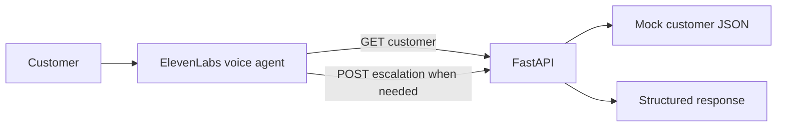

# Voice Support Triage

A deployed voice-support prototype that connects an ElevenLabs Conversational AI agent to a FastAPI service. The service looks up synthetic customer records and returns structured engineering escalations when account state indicates a technical issue.

[Live demo](https://voice-support-triage-elevenlabs.onrender.com/) · [API reference](https://voice-support-triage-elevenlabs.onrender.com/docs) · [Health check](https://voice-support-triage-elevenlabs.onrender.com/health)

## Product flow

The agent asks for a customer ID, retrieves the account state from the backend, explains the result, and creates an escalation when appropriate. Account data stays in the API rather than being generated by the language model.



## Example scenarios

| Customer | Account state | Expected support outcome |
| --- | --- | --- |
| `CUST-101` | Active subscription and entitlement | Explain the healthy account state and suggest retry guidance |
| `CUST-102` | Active subscription, disabled entitlement | Explain the access issue and create an engineering escalation |
| `CUST-103` | Inactive subscription | Explain the subscription issue without an engineering escalation |
| `CUST-999` | No matching record | API returns `404`; the agent should ask the user to verify the ID |

## API

| Method | Route | Purpose |
| --- | --- | --- |
| `GET` | `/health` | Deployment health check |
| `GET` | `/customers/{customer_id}` | Return a customer record or `404` |
| `POST` | `/escalations` | Validate and return a structured escalation |

The escalation request requires `customer_id`, `issue`, `finding`, and a non-empty list of `troubleshooting_performed` steps. FastAPI's interactive API reference is available at `/docs` on the live service.

## Run locally

```bash
git clone https://github.com/tobivader/voice-support-triage-elevenlabs.git
cd voice-support-triage-elevenlabs
python3 -m venv .venv
source .venv/bin/activate
python -m pip install -r requirements.txt
uvicorn app.main:app --reload
```

Open `http://127.0.0.1:8000/` for the demo, `http://127.0.0.1:8000/docs` for the API reference, or `http://127.0.0.1:8000/health` for the health check. The browser widget needs microphone permission for voice conversations.

## Tests

```bash
pytest -q
```

The suite covers health checks, known and unknown customer lookups, escalation creation, and request validation.

## Deployment

The repository includes a Render Blueprint in `render.yaml`. Connect the repository to Render and deploy the web service with the configured health check at `/health`. Render's free service may spin down while idle, so its first request can be delayed.

The page embeds the published ElevenLabs agent. Its agent ID is a public widget identifier, not a secret; API keys must never be placed in browser code. Webhook tools should target the deployed service's `/customers/{customer_id}` and `/escalations` routes. See [the ElevenLabs setup guide](docs/elevenlabs-setup.md) for configuration and test steps.

## Scope and next steps

This is a portfolio/demo project, not a production support system. Customer records are synthetic, the API has no authentication, and escalations are stored in process memory and are lost when the service restarts. Production use would require authentication and authorization, durable storage, operational monitoring, and safeguards around escalation creation.

Potential extensions include database-backed tickets, integration with a ticketing platform, authenticated customer records, and broader support scenarios.

## Stack

Python · FastAPI · Pydantic · pytest · ElevenLabs Conversational AI · Render
