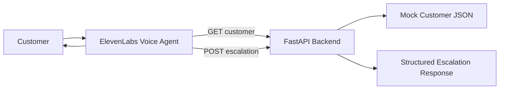

# Voice Support Triage

A lightweight ElevenLabs voice agent MVP that checks mock SaaS account data through a FastAPI backend and either explains the next step or creates a structured engineering escalation.

## What problem does it solve?

A customer reports that they cannot access a service. Instead of a support analyst manually checking account details from scratch, the voice assistant can ask for a customer ID, call a backend API, interpret the account state, and either explain the likely cause or create an escalation for engineering.

## Why I built it

This project is designed to demonstrate:

- customer-facing technical problem solving;
- Python and FastAPI API work;
- valid integration patterns between an LLM and a backend service;
- clear support decision logic;
- a clean, explainable MVP for a portfolio or interview conversation.

## Demo

Use the mock IDs:

- `CUST-101` — healthy account, retry guidance
- `CUST-102` — missing entitlement, engineering escalation
- `CUST-103` — inactive subscription, no escalation
- `CUST-999` — unknown customer, ask for verification

## Architecture



## How it works

1. The customer shares a problem in the voice interface.
2. The agent asks for a customer ID.
3. The agent calls the backend `GET /customers/{customer_id}` endpoint.
4. The API returns structured account data from mock JSON.
5. The agent explains the next step in simple language.
6. If the entitlement is missing, the agent calls `POST /escalations` and records the troubleshooting details.

## API endpoints

### `GET /health`

Returns:

```json
{"status": "ok"}
```

### `GET /customers/{customer_id}`

Returns the matched customer record or a `404` with a readable error.

### `POST /escalations`

Creates a structured escalation record with:

- `customer_id`
- `issue`
- `finding`
- `troubleshooting_performed`
- generated `escalation_id`

## ElevenLabs integration

The AI agent should not be the source of truth for account status. It should call the API and use the returned data to ground its answer.

This keeps the workflow realistic and reduces hallucination.

## Local setup

```bash
cd "VOICE_SUPPORT_PROJECT_FOLDER"
python3 -m venv .venv
source .venv/bin/activate
pip install -r requirements.txt
uvicorn app.main:app --reload
```

Then open:

- `http://127.0.0.1:8000/` for the landing page
- `http://127.0.0.1:8000/health` for the health check

## Testing

Run:

```bash
pytest -q
```

The test suite covers:

- health endpoint;
- valid customer lookup;
- unknown customer handling;
- escalation creation;
- escalation validation errors.

## Deployment

This project is configured for Render using the included `render.yaml` file.

Use:

```bash
uvicorn app.main:app --host 0.0.0.0 --port $PORT
```

Render services may sleep when inactive, so the first request can take longer than usual.

## Results and acceptance testing

This MVP was validated with the following flow:

| Scenario | Expected behavior | Result |
| --- | --- | --- |
| CUST-101 | healthy account guidance | works |
| CUST-102 | missing entitlement + escalation | works |
| CUST-103 | inactive subscription, no escalation | supported |
| CUST-999 | 404 and verification prompt | works |

## What I learned

- It is better for the model to fetch data than to guess it.
- Clear tool descriptions matter more than fancy UI.
- A real workflow becomes easier to trust when the API contract is explicit.
- A small MVP can still demonstrate meaningful technical integration patterns.

## Future improvements

- persist escalations to a database;
- connect to Jira or a ticketing system;
- add authentication;
- add richer customer data or knowledge-base logic;
- add more support scenarios and better observability.

## Tech stack

- Python
- FastAPI
- Pydantic
- pytest
- ElevenLabs voice agent
- Render free web service
